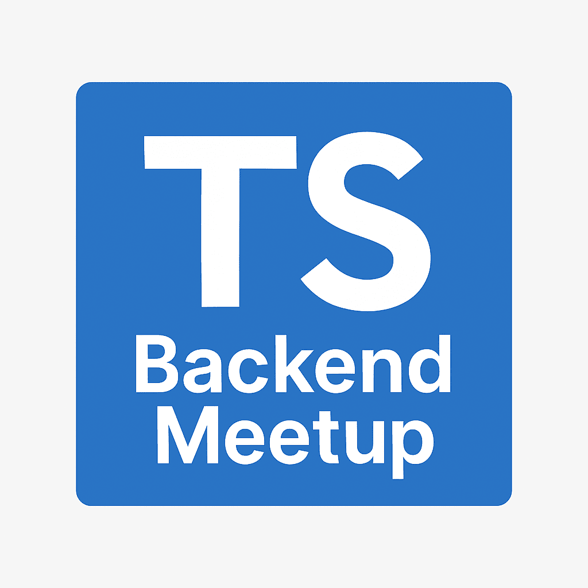

# meetup

## 🧪 TypeScript 백엔드 개발자 모임 - 1회차 소개

### 🎉 1회차 모임 개최 안내

- **일시**: 2025년 5월 13일 (화) 오후 7시
- **장소**: 서울 강남구 테헤란로8길 25 3층 (그라운드옥탑)
- **참가비**: 10,000원  
  _(노쇼 방지 및 간단한 다과 준비용으로만 사용됩니다.)_
- **신청마감**: 장소 섭외를 위해 04/25 오후 6시 선착순으로 제한합니다.  
- **신청 링크**: [eventus](https://event-us.kr/tsbackendmeetup/event/102317) 를 통해 신청 부탁드립니다.

### 🧑‍💻 모임의 목적은?

이번 모임은 **TypeScript 기반 백엔드 개발자**들의 커리어 성장과 네트워킹을 위한 자리입니다.  
백엔드 위주이긴 하지만, 프론트엔드 및 풀스택 개발자분들의 참여도 환영입니다!  
기술과 경험, 고민과 목표를 함께 나눌 수 있는 오픈 커뮤니티를 만들어 가고자 합니다.

### 📢 발표 및 프로그램 안내

- 총 **4명의 발표자**가 각 15~45분 동안 발표를 진행할 예정입니다.
- 발표 이후에는 누구나 자유롭게 발언할 수 있는 **오픈 마이크** 세션도 준비되어 있습니다.
  - 예: 채용 소식, 사이드 프로젝트/오픈소스 소개 등
- 마지막에는 **자유 네트워킹 시간**도 마련되어 있으니 다양한 분들과 자연스럽게 이야기 나누실 수 있어요!

### 📣 발표자 모집 안내

발표자도 선정되지 않을 경우를 대비해 티켓 구매 부탁드립니다. ( 선정 시 바로 환불해드리겠습니다! )  
발표 신청은 누락을 방지하기 위해 kscodebase@gmail.com, 7471919@naver.com 두 개의 이메일로 보내주세요!

- **신청 마감**: 4월 16일 (수) 밤 11시 59분까지
- **선정 결과 안내**: 4월 18일 (금) 중 개별 연락 예정
- **발표자 수**: 총 4명
- **특별 우대**: 매달 1명, **경력 2년 이하의 주니어 개발자** 발표 우선권 제공!

**발표 신청 시 아래 정보를 함께 제출해주세요:**

1. 이름 / 소속 / 이메일 / 전화번호
2. 발표 주제
3. 주제 설명
4. 예상 발표 시간 (15~45분 내)

### 💬 문의 및 소통 채널

궁금하신 점이 있으시다면 아래 채널 중 편한 곳으로 연락 주세요!

1. [NestJS 오픈카톡방](https://open.kakao.com/o/ggLiN79c)에서 **@kakasoo** 태그
2. [LinkedIn DM](http://www.linkedin.com/in/kakasoo)
