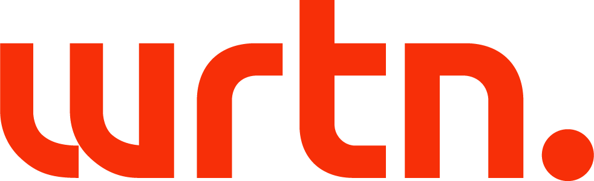
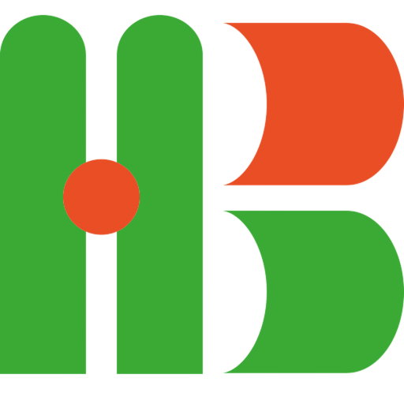

# meetup

# 2025년 6월 모임 소개

- 날짜 및 시간: 2025년 6월 28일, 13시부터 17시까지 총 4시간 (늦지 않게 꼭 제시간에 와주셔야 합니다!)
- 장소: [역삼 센터필드 EAST](https://place.map.kakao.com/374364522) 18층 (지하철 2호선 역삼역 8번 출구 도보 500미터)
- 출입 방법:
  1. 1층 GATE 입장 (QR 체크 / 모임 당일에 이메일로 제공됩니다.)
  2. 18층 이동 후 출입 등록 (강의장 안내)
- 발표 순서
- 타임 테이블은 운영진 논의에 따라 계속 조정될 수 있습니다!

| 시간          | 내용 / 발표자                                                                              | 소속               | 주제                                                                                       | 자료                        |
| ------------- | ------------------------------------------------------------------------------------------ | ------------------ | ------------------------------------------------------------------------------------------ | --------------------------- |
| 12:30 - 13:00 | 입장 안내 & 크라이치즈버거 다과 증정!                                                      | TSBM               |                                                                                            |                             |
| 13:00 - 13:30 | 모임 소개 & 후원사 소개                                                                    | TSBM               |                                                                                            |                             |
| 13:30 - 13:40 | 모임 시작                                                                                  |                    | 모임 안내 & 후원사 소개                                                                    |                             |
| 13:40 - 14:10 | session1 - [조용진](https://www.linkedin.com/in/drakejin/)님                               | 썬데이타이쿤       | AWSome IaC (테라폼/ AWS 관련)                                                              | [발표 자료](./session1.pdf) |
| 14:10 - 14:20 | 질의응답                                                                                   |                    |                                                                                            |                             |
| 14:20 - 14:50 | session2 - [이정현](https://www.linkedin.com/in/%EC%A0%95%ED%98%84-%EC%9D%B4-8b2655211/)님 | ㈜비바리퍼블리카   | 웹소켓 실시간 편집 구현 방식 및 시스템 전반적인 구조                                       | [발표 자료](./session2.pdf) |
| 15:00 - 15:10 | 질의응답                                                                                   |                    |                                                                                            |                             |
| 15:10 - 15:50 | session3 - [유인동](https://www.linkedin.com/in/indongyoo/)님                              | (주)마플코퍼레이션 | 주제: 멀티패러다임 백엔드/동시성 프로그래밍 부제: MSA 기반 백엔드 서비스 핵심 구현 사례 |                             |
| 15:50 - 16:00 | 질의응답                                                                                   |                    |                                                                                            |                             |
| 16:00 - 17:00 | 자유 네트워킹                                                                              |                    |                                                                                            |                             |
| 17:00         | 네트워킹 경품                                                                              |                    |                                                                                            |                             |
| 17:00         | 모임 종료 겸 마무리                                                                        |                    |                                                                                            |                             |

## 🏢 후원사

> 후원을 원하시는 모든 분들은 [이곳](./CONTIBUTING.md)을 읽어주세요.

- [AWS(Amazon Web Services)](https://aws.amazon.com/)에서 장소를 대관해주셨습니다!
- [뤼튼 테크놀로지스](https://wrtn.io/)에서 모임 비용 일부 (다과 비용)을 후원해주십니다.
- [한빛미디어](https://www.hanbit.co.kr/)에서 도서를 후원해주십니다!

<table>
  <tr>
    <td align="center">
       
      <b>AWS</b>
    </td>
    <td align="center">
       
      <b>뤼튼 테크놀로지스</b>
    </td>
    <td align="center">
       
      <b>한빛미디어</b>
    </td>
  </tr>
</table>

## 🧑‍💻 모임의 목적은?

이번 모임은 **TypeScript 기반 백엔드 개발자**들의 커리어 성장과 네트워킹을 위한 자리입니다.  
백엔드 위주이긴 하지만, 프론트엔드 및 풀스택 개발자분들의 참여도 환영입니다!  
기술과 경험, 고민과 목표를 함께 나눌 수 있는 오픈 커뮤니티를 만들어 가고자 합니다.

## 📺 공식 유튜브 채널

[Typescript Backend Meepup 공식 유튜브 채널](https://youtube.com/@typescriptbackend)

## 💬 문의 및 소통 채널

궁금하신 점이 있으시다면 아래 채널 중 편한 곳으로 연락 주세요!

1. [NestJS 오픈카톡방](https://open.kakao.com/o/ggLiN79c)에서 **@kakasoo** 태그
2. [LinkedIn DM](http://www.linkedin.com/in/kakasoo)
